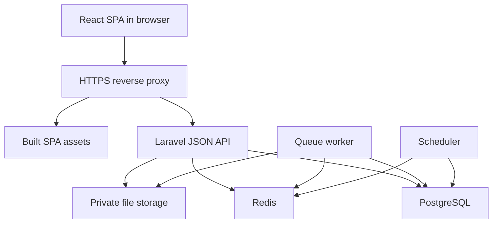

# Architecture proposal

Date: 7 October 2026. Status: proposed for review. The owner approved documentation preparation and explicitly required an API-based SPA without Inertia. This document does not authorize application implementation.

## Evidence and scope

The target repository was empty when inspected. There is no application, existing dependency lockfile or project-specific implementation convention to reuse here. The requirements are the baseline. Company Tools source was not supplied or inspected; reuse from it remains unverified. No conclusion that existing HR products cannot meet this need is supported.

## Recommended shape

One repository, two applications: `backend/` for Laravel and `frontend/` for a standalone React/TypeScript SPA. Proposed `infra/` contains Docker and deployment definitions, `docs/` the contracts and decisions. These application directories are future work, not present deliverables.

The backend remains a modular monolith. Controllers validate input and call domain actions; policies authorize actions and projections; transactions enforce invariants. Separate modules do not require separate Composer packages, databases or services. Frontend modules consume JSON contracts only. Do not expose Eloquent serialization as the public contract.

| Module | Owns | Important boundary |
|---|---|---|
| Identity/Tenancy | Accounts, memberships, invitations, scope grants, tenant lifecycle | Global identity grants no HR access |
| Organization | Companies, departments, locations, calendars | Company is the employing legal entity |
| Workforce | Employees, employments, assignments, terms, contracts | Other modules cannot edit employment truth directly |
| Documents | Ownership, versions, quarantine, review and expiry | Metadata and file content have separate authorization |
| Leave | Policy snapshots, request durations and balance ledger | Workflow approval cannot bypass entitlement checks |
| Attendance | Raw clocks, shifts, derived totals and corrections | Preserve evidence; overtime is time, not pay |
| Workflow | Published definitions, step resolution and decisions | Invokes authorized domain operations; no arbitrary code |
| Lifecycle/Tasks | Templates, instances, assigned work and evidence | Access revocation is not blocked by settlement paperwork |
| Messaging/Integrations | Outbox, delivery attempts, scoped credentials | At-least-once delivery; consumers deduplicate |
| Reporting/Audit | Authorized projections and redacted history | Reports do not mutate domain state |

## Deployment topology

Serve SPA assets and `/api/v1`, `/sanctum` and authentication routes through the same HTTPS origin initially. This preserves independent API/SPA builds while reducing cookie and CORS configuration. Route unmatched frontend navigation to the SPA index, but never rewrite missing API or authentication endpoints to HTML. Build frontend assets in a Node build stage; no Node application server or SSR is required for V1.

A later split into sibling subdomains is possible with explicit credentialed CORS and cookie configuration. Unrelated top-level domains are outside this session-authentication proposal and require a revised identity design. No public PostgreSQL or Redis ports. Web, worker and scheduler use the same backend image, with different process commands and least-privilege configuration.

## Architectural decisions proposed for approval

| ID | Recommendation | Alternative and consequence |
|---|---|---|
| A01 | Laravel API plus React SPA; no Inertia (confirmed) | Inertia was considered and rejected by the owner |
| A02 | Shared PostgreSQL, explicit tenant columns, application policies plus tenant RLS | Database per tenant improves separation but increases provisioning, upgrades and backup work; reconsider for contractual isolation needs |
| A03 | Company scope enforced by policies, authorized query builders and field projections | Tenant RLS alone does not provide company or sensitive-field authorization |
| A04 | Sanctum cookie sessions plus headless Fortify; privileged MFA | Local-storage bearer sessions add browser credential handling; external SSO is deferred |
| A05 | Domain actions and transactions; Redis jobs and database outbox | Microservices and event sourcing increase operating cost without a demonstrated need |
| A06 | Explicit permission assignments with scopes; bounded sequential workflows | A general rule language or universal role hierarchy would make authorization harder to review |
| A07 | Half-open date ranges internally: start inclusive, end exclusive | UI inclusive dates must be normalized; avoid mixed interval semantics |
| A08 | One active employment per employee in V1 operations, while schema permits future concurrency | Enabling overlapping active employment changes leave, reporting and attendance semantics and needs approval |
| A09 | English initially with localization-ready structure | Arabic/RTL is not silently included |

## Operations and failure handling

Domain changes, audit entries and outbox entries commit together. Workers deliver after commit. Publishing may duplicate after crashes; event IDs and receiver idempotency make duplication safe. Do not describe queue uniqueness locks as an exactly-once guarantee. Deduplicate business effects in PostgreSQL using unique operation keys and transactional state checks.

Authorize exports both when requested and before creation/download. Recheck membership, tenant suspension and resource access when queued work runs. System scheduled jobs use narrowly defined service authority, not a removed user's credentials. Sensitive cache entries include tenant, principal, scope revision and resource parameters; membership changes invalidate authorization-sensitive caches.

Start with PHP-FPM and ordinary workers. Do not introduce Octane, PgBouncer, read replicas or partitioning before there is a measured need. If introduced, rerun the connection/context isolation suite. Long exports use small authorized batches, not one long request transaction. No outbound HTTP or malware scanning inside a long database transaction.

Health endpoints expose minimal status. Readiness distinguishes database reachability, queue connectivity and migration compatibility; worker failures and scheduler heartbeat need separate monitoring. Coordinate private-file and database backup restoration. Proposed RPO/RTO and performance targets in the baseline remain unmeasured and hosting-dependent.

## Decisions still needed

| Decision | Recommended default | Required before |
|---|---|---|
| Reuse vs independent build | Independent build is provisional; inspect Company Tools if available and record accepted trade-off | Application scaffolding |
| RLS and company scope design | A02/A03, contingent on spike success | Domain migrations |
| Runtime versions | Dependency document candidates | Lockfile creation |
| Redis license/deployment choice | Pin a supported Redis 8 release after owner review | Redis distribution/deployment |
| Hosting, storage and scanner | Provider-neutral interfaces; choose actual services and budget | Production configuration |
| Legal-entity and concurrent employment rules | A07/A08 and one company per legal employer | Workforce implementation |
| Leave, transfer and attendance policies | HR-owned effective-dated policies; no assumed statutory values | Relevant module implementation |
| Retention and support access approval owner | Named HR/security/operations owners | Production pilot |
| Project license | Owner chooses; do not infer from repository visibility | Reuse/distribution decision |

See [dependencies](dependencies.md), [data model](data-model.md), [permissions](permissions.md), [API contract](api-contract.md) and [isolation validation](isolation-validation.md).
