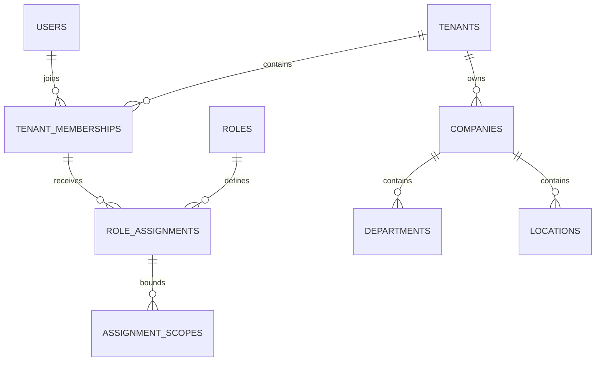
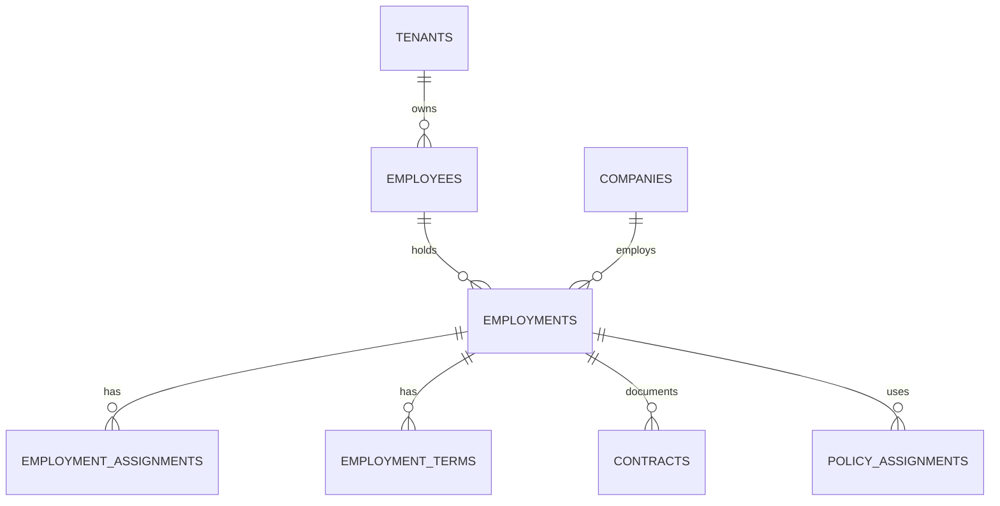
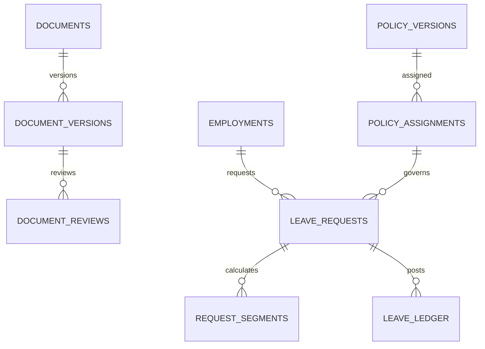

# Logical data model and integrity proposal

Status: logical proposal, not migrations. V1 baseline remains authoritative; new defaults below need architecture approval.

## Identity, access and organization

Global `users` hold login identity only. A user can belong to multiple tenants. `tenant_memberships` carries `(tenant_id, user_id)`, status, authorization revision and optional tenant employee link. Global sessions track authenticated identity; tenant selection is request-bound, not a mutable session-wide authorization grant. Identity endpoints expose only the current user's memberships.

Roles are tenant-owned permission bundles; permission names are a global code-defined catalog. Role assignments attach a role to a membership. Explicit scope rows tie that assignment to tenant-wide, company, department, reporting-team or self access. **Do not multiply all granted roles by all companies the user can see.** A Company A HR grant and Company B employee grant must remain separate. A company-access projection can drive the switcher but cannot authorize actions.

A scope row has one validated kind and the corresponding reference; do not store unvalidated identifiers in JSON. Tenant-wide grants are explicit. Delegation grants reference the original authority and have start/end times. Support grants are separate, time-limited records with requester, approver, reason, subject and permitted actions.

## Workforce and employment history

Employee identity belongs to the tenant; employment belongs to exactly one company. Rehire adds an employment, transfer closes one and creates another. Store an explicit transfer operation linking source/destination, effective date, actor, approval, reconciliation decisions and idempotency key. The same transfer action cannot create two destinations on retry.

Assignments capture effective-dated department, position, location, calendar and manager-employment reference. Reject self-management and cycles across the relevant effective interval. Cross-company reporting requires explicit business approval and visibility rules; initial default is same-company reporting. Terms have effective dates and restricted compensation fields. Contracts retain versions and state history; no payroll engine is implied.

## Documents and leave

Documents have exactly one owner kind: tenant-person, employment or company. Prefer explicit owner references with a check constraint over a generic polymorphic ID without referential integrity. Version records store private object key, hash, media type, byte length, scan status, review state and dates. Review and expiry are independent. Tenant-person documents require explicit permitted company audiences; current employment alone does not expose every identity or historical document. Evidence marked medical requires an additional permission.

Leave requests reference employment, policy version and calculation snapshot. Segments capture business dates, units, work schedule and holiday inputs. Use fixed precision numeric units, never floats. Ledger entry types distinguish allocation, reservation, release, consumption, reversal, carry and expiry. Entries retain source operation and a unique business key. A reversal links the original; entries are not edited to repair balances.

Proposed balance convention: entitlement = allocations + accrual + adjustments + carry - expiry; used = consumption - consumption reversals; reserved = reservations - releases; available = entitlement - used - reserved. On approval, release the reservation and post consumption atomically. A cancellation reverses consumption once. Negative balance policy is explicitly evaluated. Lock a stable employment/policy balance account when reserving or adjusting; summing an unlocked ledger is insufficient under concurrency. Derived balances reconcile to the ledger.

## Other aggregates

| Aggregate | Key relationships and ownership |
|---|---|
| Workflow | Tenant definition → immutable version → instance → steps → decisions. Link each instance to one supported domain request using explicit validated references; snapshots preserve policy/approver resolution |
| Attendance | Company shift template → employment shift assignments; raw events → derived attendance records → correction/overtime requests. External-source event IDs are unique within integration scope |
| Lifecycle | Tenant/company template version → employment lifecycle instance → tasks/evidence. Business actions are idempotent; tasks cannot mutate employment directly |
| Messaging | Tenant outbox event → delivery attempts; notification uniqueness is event/recipient/channel. Minimize payload; reload authorized data at execution |
| Imports | Tenant/company batch → validated rows → committed outcomes; content fingerprint, status and per-row operation keys support safe replay |
| Integrations | Tenant principal → scoped credential → permitted resources/companies; subscriptions → webhook deliveries. Hash tokens; encrypt recoverable signing secrets |
| Audit | Tenant/company event with actor, subject, action, correlation and redacted changes; separate platform events for global identity/service operations |
| Retention | Category policy and legal holds → approved deletion/anonymization requests. Ordinary archive is not data erasure |

## Database invariants

- Every tenant-owned row has non-null `tenant_id`. Use opaque UUID identifiers and unique `(tenant_id, id)` keys for composite references. UUIDs do not replace authorization.
- Company-owned parents expose unique `(tenant_id, company_id, id)`. Children reference the full tuple. Tenant-only employee references use `(tenant_id, employee_id)`. Employment references on leave/tasks/contracts must preserve the company tuple.
- Company-scoped employment number and tenant-scoped employee number are unique within their scopes. User login uniqueness is separate from employee contact details.
- Mutable records carry an integer `version`; state-changing operations compare it. Historical append-only records use correction/reversal paths.
- UTC instants use timezone-aware timestamps; business dates use `date`; schedules store named IANA timezones. Internal ranges are `[start, end)` with a nullable end for open-ended history. UI last-working-day input converts explicitly to an exclusive next-day bound.
- Enforce non-overlapping assignment/term intervals using reviewed PostgreSQL range constraints where feasible. A proposed `btree_gist` extension requires environment verification. Lock the employee aggregate for V1 active-employment checks so concurrent activation cannot violate the rule.
- Block hard deletion of referenced history. Nullable ownership is not a shortcut for global records. Separate truly global tables explicitly.
- Index authorized access paths beginning with tenant and, where relevant, company, followed by status/date/resource. Measure query plans at representative sizes rather than adding speculative indexes.
- Cross-company transfers lock source/destination in a stable order, preserve historical scopes and require both company authorities. Settlement, pending approvals and document audiences are reviewed before commit.

Physical schemas, migration ordering, retention execution and final constraints will be reviewed during implementation. This is not a complete column-level specification for every later module.
